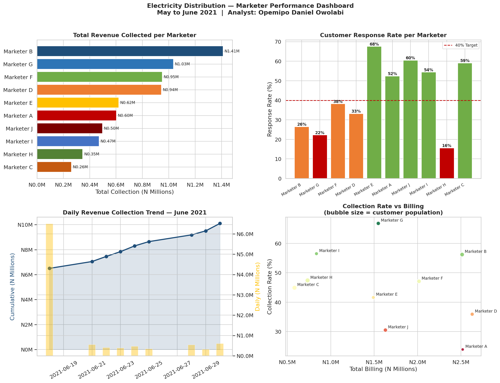

# Electricity Distribution — Marketer Performance & Revenue Analysis

**Portfolio Project 1** — Python-powered performance analysis of field marketers at a regional electricity distribution company, covering May to June 2021.

> Built by **Opemipo Daniel Owolabi** — Data Analyst | Python · SQL · Power BI · Tableau  
> Faro, Portugal | opemipoowolabi001@gmail.com

---

## Note on Data

All company names, client names, locations and identifying information have been anonymised in this public version to protect client confidentiality. The data structure, analytical approach and findings reflect real work conducted during professional employment in the electricity distribution sector.

---

## Business Problem

A regional electricity distribution company tracked field marketer performance manually across multiple service centres. Revenue collection data was updated daily but insights were buried in raw Excel sheets with no automated visualisations or trend analysis.

This project automates the full analysis pipeline replacing hours of manual work with a single Python script, answering:

1. Which marketers consistently hit their collection targets?
2. How did daily revenue collection trend across the period?
3. Which customer zones generate the most revenue?
4. What is the customer response rate per marketer?

---

## Dashboard Preview



---

## Key Findings

| Metric | Value |
|--------|-------|
| Overall Collection Rate | 43.3% |
| Top Performer | Marketer B (56.2% collection rate) |
| June 2021 Revenue Growth | +55.4% over the reporting period |

---

## What the Dashboard Shows

### 1 — Total Revenue Collected per Marketer
Horizontal bar chart comparing total monthly revenue collected by each marketer, making it immediately clear who is driving the most value.

### 2 — Customer Response Rate per Marketer
Bar chart showing what percentage of assigned customers each marketer successfully engaged. A 40% target line is shown for reference. Green = above target, Orange = borderline, Red = below target.

### 3 — Daily Revenue Collection Trend
Dual-axis chart showing cumulative collection (line) and daily incremental collection (bars). Reveals the growth trajectory across the reporting period.

### 4 — Collection Rate vs Billing Amount
Scatter plot comparing each marketer's billing amount against their actual collection rate. Bubble size represents customer population served.

---

## Project Structure

```
project1/
├── marketer_analysis.py     # Main analysis and visualisation script
├── marketer_dashboard.png   # Output: 4-panel performance dashboard
└── README.md                # This file
```

---

## How to Run

```bash
git clone https://github.com/opemipo-analytics/AEDC-MARKETERS-ANALYTICS.git
cd AEDC-MARKETERS-ANALYTICS

pip install pandas numpy matplotlib seaborn

python marketer_analysis.py
```

---

## Tools and Technologies

| Tool | Purpose |
|------|---------|
| Python 3 | Core scripting and automation |
| Pandas | Data manipulation and aggregation |
| Matplotlib | Custom visualisations and charts |
| Seaborn | Visual theme and styling |

---

## Skills Demonstrated

- Data wrangling — processing and structuring performance data
- ETL pipeline — Extract, Transform, Analyse, Visualise
- Business intelligence — translating raw data into actionable KPIs
- Data storytelling — presenting findings through clear labelled visualisations

---

## Other Projects

| Project | Description |
|---------|-------------|
| [Revenue Forecasting ML](https://github.com/opemipo-analytics/aedc-revenue-forecasting) | Machine learning revenue forecast |
| [Customer Segmentation](https://github.com/opemipo-analytics/aedc-customer-segmentation) | SQL and RFM customer segmentation |
| [Property Portfolio Analytics](https://github.com/opemipo-analytics/amcon-portfolio-analytics) | Financial property portfolio analysis |
| [Smart Meter Analytics](https://github.com/opemipo-analytics/smart-meter-analytics) | IoT smart meter revenue intelligence |

---

*Built from real operational experience as a Data Analyst in the electricity distribution sector.*
