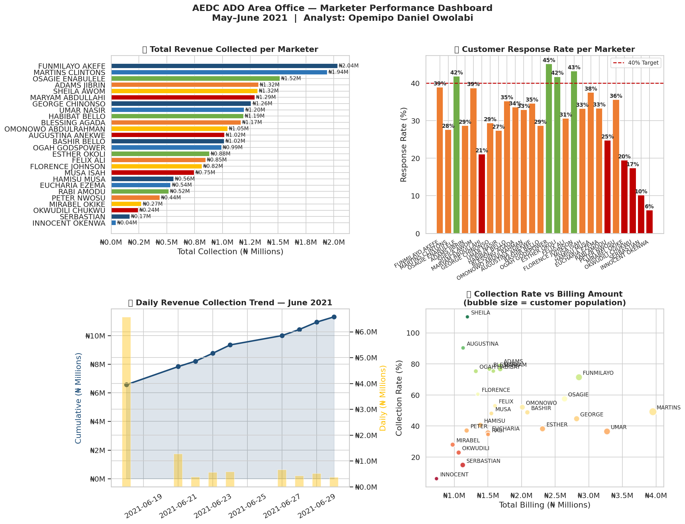

# ⚡ AEDC Marketer Performance & Revenue Analytics

**Real-world data analytics project** based on field marketer performance data from the **Abuja Electricity Distribution Company (AEDC)** ADO Area Office — May to June 2021.

> Built by **Opemipo Daniel Owolabi** — Data Analyst | Python · SQL · Power BI · Tableau  
> 📍 Faro, Portugal | 📧 opemipoowolabi001@gmail.com

---

## 🧩 Business Problem

AEDC field marketers were responsible for visiting customers, collecting electricity bills, and reporting daily revenue. Performance data was tracked manually in Excel across multiple sheets — one per day — making it impossible to:

- Quickly identify top and bottom performers
- Visualise revenue collection trends over time
- Compare customer response rates across service centres
- Spot which book codes (customer zones) were underperforming

**This project automates the entire analysis pipeline** — from raw Excel ingestion to a visual performance dashboard — replacing hours of manual work with a single Python script.

---

## 📊 Dashboard Preview



---

## 📁 Project Structure

```
aedc-marketer-analytics/
│
├── aedc_analysis.py       # Main analysis & visualisation script
├── aedc_dashboard.png     # Output: 4-panel performance dashboard
├── README.md              # This file
└── data/
    └── AEDC_ADO_2026.xlsx # Source data (19 sheets of daily tracking)
```

---

## 🔍 Key Findings

| Metric | Value |
|--------|-------|
| Total Billed (May 2021) | ₦46.02 Million |
| Total Collected | ₦24.40 Million |
| Overall Collection Rate | **53.0%** |
| Top Performer | **FUNMILAYO AKEFE** — ₦2.04M (71.4% rate) |
| Needs Improvement | INNOCENT OKENWA — ₦0.04M (6.1% rate) |
| June 2021 Revenue Growth | **+72.3%** over 9 reporting days |

---

## 📈 What the Dashboard Shows

### 1️⃣ Total Revenue Collected per Marketer
Horizontal bar chart comparing total monthly revenue collected by each marketer, making it immediately clear who is driving the most value.

### 2️⃣ Customer Response Rate per Marketer
Bar chart showing what percentage of assigned customers each marketer successfully engaged. A 40% target line is shown for reference. Green = above target, Orange = borderline, Red = below target.

### 3️⃣ Daily Revenue Collection Trend — June 2021
Dual-axis chart showing:
- **Cumulative collection** (line + fill) — total revenue built up over the month
- **Daily incremental collection** (bars) — how much was collected each day

**Finding:** Revenue grew 72.3% from mid to end of June, showing strong late-month acceleration.

### 4️⃣ Collection Rate vs Billing Amount
Scatter plot comparing each marketer's billing amount against their actual collection rate. Bubble size = customer population served. Colour gradient = collection efficiency (green = high, red = low).

---

## 🛠️ Tools & Technologies

| Tool | Purpose |
|------|---------|
| **Python 3** | Core scripting and automation |
| **Pandas** | Data extraction, cleaning, transformation |
| **Matplotlib** | Custom visualisations and charts |
| **Seaborn** | Visual theme and styling |
| **Microsoft Excel** | Original data source (19-sheet workbook) |

---

## ▶️ How to Run

```bash
# Clone the repo
git clone https://github.com/opemipo-analytics/aedc-marketer-analytics.git
cd aedc-marketer-analytics

# Install dependencies
pip install pandas matplotlib seaborn openpyxl

# Run the analysis
python aedc_analysis.py
```

The script will:
1. Load and parse all 19 sheets from the Excel workbook
2. Extract marketer performance records
3. Build the daily collection trend
4. Generate the 4-panel dashboard image
5. Print key business insights to the console

---

## 💡 Skills Demonstrated

- **Data wrangling** — handling messy, multi-sheet Excel files with inconsistent headers
- **ETL pipeline** — Extract → Transform → Analyse → Visualise
- **Business intelligence** — translating raw operational data into actionable KPIs
- **Data storytelling** — presenting findings through clear, labelled visualisations
- **Real-world context** — all data comes from an actual electricity utility operation

---

## 🔗 About the Analyst

I am a Senior Data Analyst with 6+ years of experience across the energy, finance, and consulting sectors. I specialise in:

- Python, SQL, R for data analysis
- Power BI & Tableau for dashboards
- Statistical modelling and predictive analytics
- Business intelligence and executive reporting

📌 Currently based in Faro, Portugal  
🎓 MSc Occupational Health & Safety — University of Algarve (2025–current)  
📜 Google Professional Data Analytics Certification  

👉 [View more projects on GitHub](https://github.com/opemipo-analytics)

---

*This project is part of my data analytics portfolio, showcasing real-world analytical skills using data from my professional experience at AEDC.*
